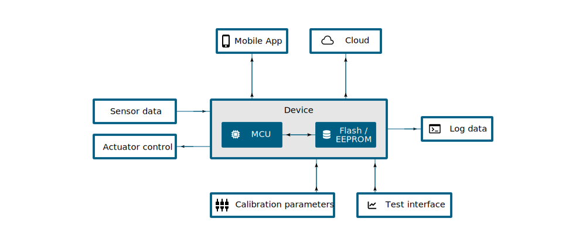
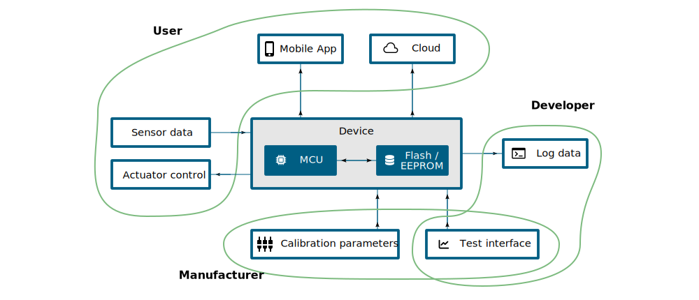
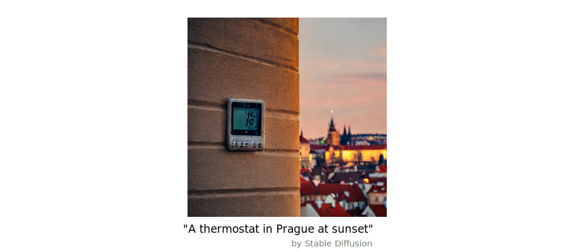
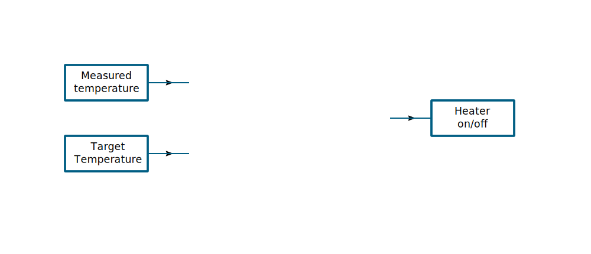
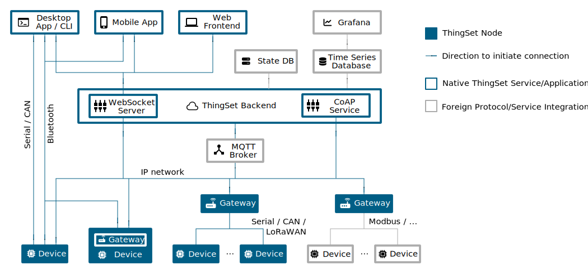
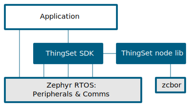
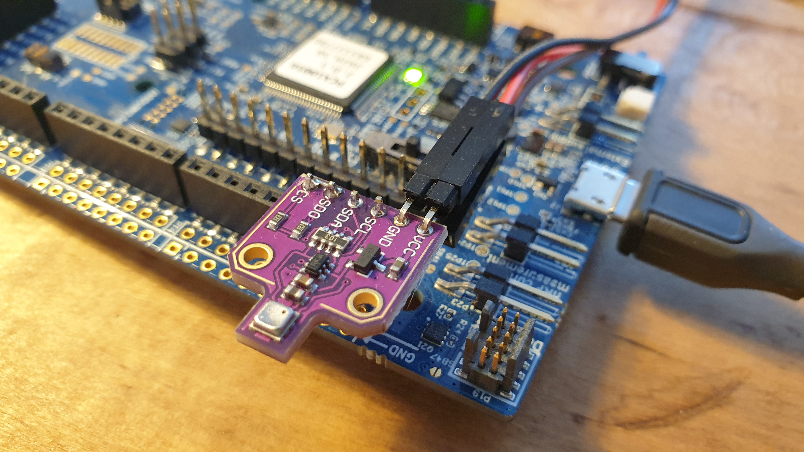
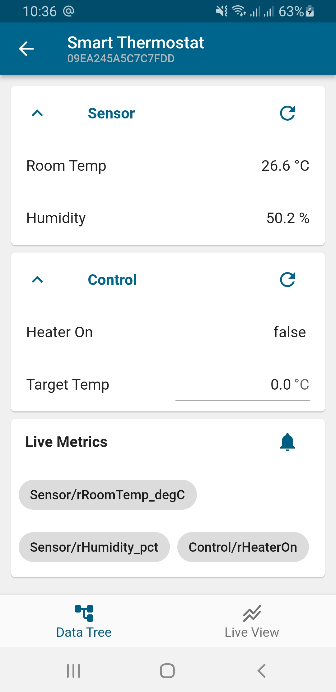
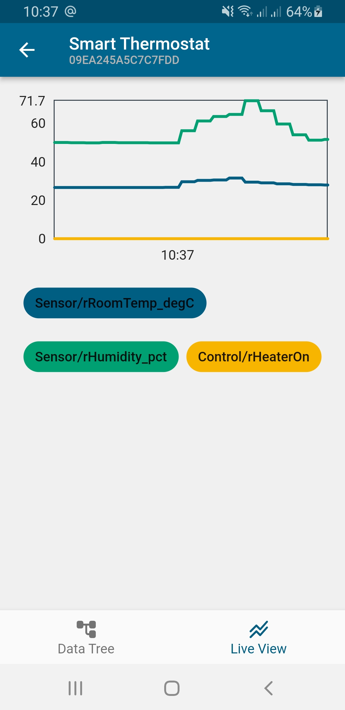

class: first

# ThingSet + Zephyr:<br/>Transport-Agnostic Device<br/>Connectivity Within 10 Minutes

.author[Martin Jäger - Libre Solar]

June 27, 2023

.hashtag[\#EMBEDDEDOSSUMMIT]

---

# Data Flows in Embedded Devices



--



???

Let's imagine a typical embedded device.

It has a microcontroller with its RAM and some sort of persistent memory like Flash or EEPROM.

- Data input/output
- EEPROM/Flash for storage
- Factory calibration
- Processing of data in the cloud

Usual solution: Different data format and transport protocol for each purpose.

- Raw C structs exchanged between RAM and EEPROM: What happens if you add a new struct member
  in the next version of your firmware?
- Text logging data on serial
- Custom BLE service for app (binary format)
- Some JSON or protobuf for cloud connectivity
- Special commands on serial or shell for calibration + testing

What if we could use the same data format and protocol everywhere?

---

# Agenda

<br />

## 1. Semantic Data Model
## 2. ThingSet Protocol
## 3. Transports & Mappings
## 4. Zephyr Integration
## 5. Demo Time!
## 6. Roadmap and Outlook

---

# Example Application



--



---

# Semantic Data Model

.left-column[

### Terminology

- **Group**: Category of data objects belonging together, forming the data hierarchy.
- **Data Item**: Actual value (leaf node of the tree structure)
- **Subset**: Collection of pointers to actual data items
- **Overlay**: Related meta information of actual data.

]

--

.right-column[

```json
{
    "pNodeID": "C001CAFE01234567",    # data item
    "pNodeName": "Smart Thermostat",
    "Sensor": {                       # group
        "rRoomTemp_degC": 18.3,
        "rHumidity_pct": 60.2
    },
    "Control": {
        "rHeaterOn": true,
        "sTargetTemp_degC": 22.0
    },
    "mLive": [                        # subset
        "Sensor/rRoomTemp_degC",
        "Sensor/rHumidity_pct",
        "Control/rHeaterOn"
    ],
    "_Reporting": {                   # overlay
        "mLive": {
            "sEnable": true,
            "sInterval_s": 1
        }
    }
}
```

]

---

# Data Object Prefixes

.left-column[

### Data Items

| Prefix | Description       |
|:------:|-------------------|
| `c`    | constant item     |
| `r`    | read-only item    |
| `w`    | write-able item   |
| `s`    | stored item       |
| `t`    | timestamp         |
| `x`    | executable item   |

]

.right-column[

### Subsets

| Prefix | Description       |
|:------:|-------------------|
| `a`    | attribute subset  |
| `e`    | event subset      |
| `m`    | metrics subset    |

### Groups and Overlays

No prefix, starting with upper-case letter.

]

---

# Access Protocol

.left-column[

### Message layout

```
     +----------+-------------------+-------------+
byte |    0     |      1 .. n       |   n+1 .. m  |
     +----------+-------------------+-------------+
     | function |     endpoint      | CBOR / JSON |
     |   code   |     / status      |   payload   |
     +----------+-------------------+-------------+
```

### Report/Desire function codes

| Text | Binary          | Description       |
|:----:|:---------------:|-------------------|
| `@`  | `0x1D`          | Desire            |
| `#`  | `0x1F`          | Report            |

]

.right-column[

### Request/Response function codes

| Text | Binary          | Description       |
|:----:|:---------------:|-------------------|
| `?`  | `0x01` / `0x05` | GET / FETCH |
| `=`  | `0x07`          | UPDATE      |
| `+`  | `0x06`          | CREATE    |
| `-`  | `0x04`          | DELETE    |
| `!`  | `0x02`          | EXEC      |
| `:`  | `0x80` - `0xFF` | Response + code |

]

---

# Request/Response Examples

.left-column[
Data model:

```json
{
    "pNodeID": "C001CAFE01234567",
    "pNodeName": "Smart Thermostat",
    "Sensor": {
        "rRoomTemp_degC": 18.3,
        "rHumidity_pct": 60.2
    },
    "Control": {
        "rHeaterOn": true,
        "sTargetTemp_degC": 22.0
    },
    "mLive": [
        "Sensor/rRoomTemp_degC",
        "Sensor/rHumidity_pct",
        "Control/rHeaterOn"
    ],
    "_Reporting": {
        "mLive": {
            "sEnable": true,
            "sInterval_s": 1
        }
    }
}
```
]

.right-column[

GET all `Sensor` values:

```json
?Sensor

:85 {"rRoomTemp_degC":18.3,"rHumidity_pct":60.2}
```

UPDATE target temperature in `Control` endpoint:

```json
=Control {"sTargetTemp_degC":20}

:84
```

DELETE humidity sensor from live metrics subset:

```json
-mLive "Sensor/rHumidity_pct"

:82
```
]

---

# Report/Desire Examples

.left-column[
Data model:

```json
{
    "pNodeID": "C001CAFE01234567",
    "pNodeName": "Smart Thermostat",
    "Sensor": {
        "rRoomTemp_degC": 18.3,
        "rHumidity_pct": 60.2
    },
    "Control": {
        "rHeaterOn": true,
        "sTargetTemp_degC": 22.0
    },
    "mLive": [
        "Sensor/rRoomTemp_degC",
        "Sensor/rHumidity_pct",
        "Control/rHeaterOn"
    ],
    "_Reporting": {
        "mLive": {
            "sEnable": true,
            "sInterval_s": 1
        }
    }
}
```
]

.right-column[
Report of `Sensor` group:

```json
#Sensor {"rRoomTemp_degC":18.3,"rHumidity_pct":
60.2}
```

Report of live metrics subset:

```json
#mLive {"Sensor":{"rRoomTemp_degC":18.3,"rHumidity_
pct":60.2},"Control":{"rHeaterOn":true}}
```

Desire to change target temperature:

```json
@Control {"sTargetTemp_degC":20}
```
]

---

# Network Topology



---

# Transports & Mappings

.left-column[

### Transports

Message-oriented, bi-directional and reliable communication channels to exchange ThingSet messages transparently.

- WebSocket
- CAN (with ISO-TP)
- Serial (with optional CRC)
- Bluetooth LE (with packetization)
- SMS

]

--

.right-column[

### Mappings

ThingSet messages are translated into the native format required by the protocol. Not all features of ThingSet may be supported.

- MQTT
- LoRaWAN
- CoAP

]

---

# Zephyr Integration

.left-column[

### Firmware Modules



]

--

.right-column[

### Used Zephyr features

- Iterable Sections
- Peripheral drivers
  - UART / USB serial
  - CAN & ISO-TP
- Bluetooth
- Shell subsystem
- Custom logger backend
- ...

]

---

# Demo Time!

<br/>

.left-column[

]

.right-column[
- Zephyr RTOS v3.4
- Nordic nRF52840 DK
- Bosch BME680 Sensor
]

---

# Summary

.left-column[

Started with a data model ...

```json
{
    "pNodeID": "C001CAFE01234567",
    "pNodeName": "Smart Thermostat",
    "Sensor": {
        "rRoomTemp_degC": 18.3,
        "rHumidity_pct": 60.2
    },
    "Control": {
        "rHeaterOn": true,
        "sTargetTemp_degC": 22.0
    },
    "mLive": [
        "Sensor/rRoomTemp_degC",
        "Sensor/rHumidity_pct",
        "Control/rHeaterOn"
    ],
    "_Reporting": {
        "mLive": {
            "sEnable": true,
            "sInterval_s": 1
        }
    }
}
```
]

--

.right-column[

... finished up with an app.




]

---

# Roadmap and Outlook

<br />

## 1. Release v1.0 spec till end of 2023
## 2. Grow a community around ThingSet
## 3. Improve ThingSet SDK and app features
## 4. Support for other programming languages

---

class: last

.resources[

# Resources

## Libre Solar

[libre.solar](https://libre.solar) | [github.com/LibreSolar](https://github.com/LibreSolar)

## ThingSet

[thingset.io](https://thingset.io) | [github.com/ThingSet](https://github.com/ThingSet)

]
